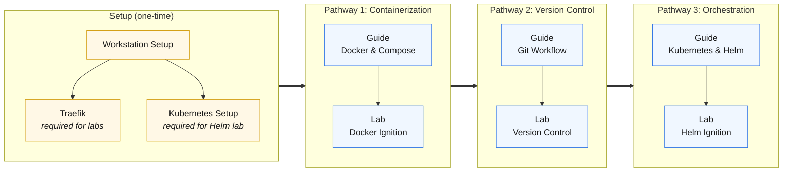

# Getting Started

Welcome to Ignition Guides - a collection of community guides for working with
[Ignition SCADA](https://inductiveautomation.com/) using modern development practices.

## What Is in Here

| Section | What You Will Find |
| --- | --- |
| [Guides](../guides/docker/intro.md) | Step-by-step procedures for real workflows |
| [Labs](../labs/docker-ignition-lab.md) | Hands-on exercises that walk a workflow end to end |
| [Reference](../reference/git-style-guide.md) | Quick-reference pages for conventions, standards, and Ignition concepts |
| [Tools](../tools/overview.md) | Community tools built around Ignition |

## Minimum Setup

Set up these tools once - every guide references back here rather than repeating the steps.

**Required for all guides:**

- [Workstation Setup](./workstation-setup.md) - VS Code, Git, GitHub CLI, Docker Desktop

**Required for labs:**

- [Traefik Reverse Proxy](./traefik.md) - Named local URLs instead of port numbers
  (e.g., `my-gw.localtest.me` instead of `localhost:9088`)

## Learning Pathways

Pathways are named by what you are learning, not by skill level. Each pathway ends with a lab before the next one begins. If you already know the topic, skip the guide and jump straight to the lab to verify - or skip the pathway entirely and enter at the next one.

Click any node to jump to that guide or lab.

**Containerization** covers Docker Compose, the project-template architecture, licensing, and day-to-day gateway operations. Start here to run an Ignition gateway locally with the project-template.

**Version Control** covers Git, GitHub, and source control workflows for the Ignition project files produced by your gateway. Continue here once you have a running gateway and want to track its configuration in Git.

**Orchestration** covers Kubernetes concepts for Ignition and using the official Inductive Automation Helm chart to deploy gateways on a local cluster. Continue here once you understand the Docker and version-control workflows.
