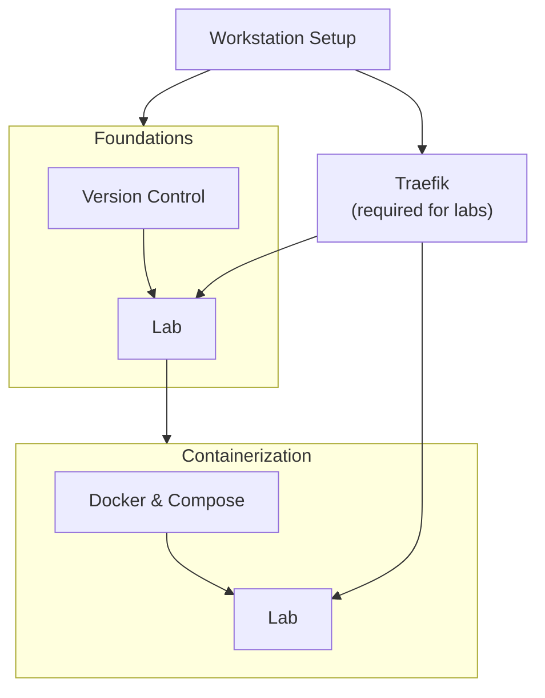

# Getting Started

Welcome to Ignition Guides - a collection of community guides for working with
[Ignition SCADA](https://inductiveautomation.com/) using modern development practices.

## What Is in Here

| Section | What You Will Find |
| --- | --- |
| [Guides](../guides/version-control/intro.md) | Step-by-step procedures for real workflows |
| [Labs](../labs/version-control-lab.md) | Hands-on exercises that walk a workflow end to end |
| [Reference](../reference/git-style-guide.md) | Quick-reference pages for conventions, standards, and Ignition concepts |
| [Tools](../tools/overview.md) | Community tools built around Ignition |

## Minimum Setup

Set up these tools once - every guide references back here rather than repeating the steps.

**Required for all guides:**

- [Workstation Setup](./workstation-setup.md) - VS Code, Git, GitHub CLI, Docker Desktop

**Required for labs:**

- [Traefik Reverse Proxy](./traefik.md) - Named local URLs instead of port numbers
  (e.g., `my-gw.localtest.me` instead of `localhost:9088`)

## Learning Pathways

Pathways are named by what you are learning, not by skill level. Each pathway ends with a lab before the next one begins. If you already know the topic, skip the guide and jump straight to the lab to verify - or skip the pathway entirely and enter at the next one.

**Foundations** covers Git, GitHub, and version control workflows for Ignition projects. Start here if you are new to tracking Ignition configuration in source control.

**Containerization** covers Docker Compose, the project-template architecture, licensing, and day-to-day gateway operations. Start here if you are comfortable with Git but new to running Ignition in containers.
