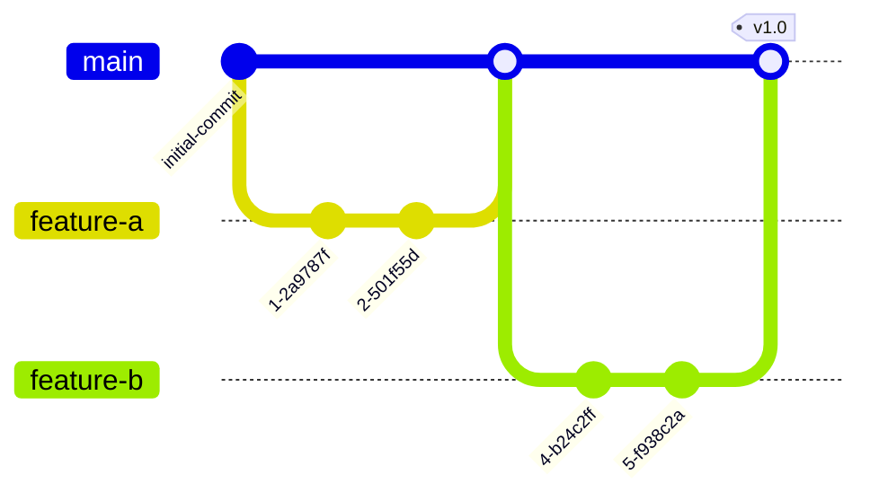
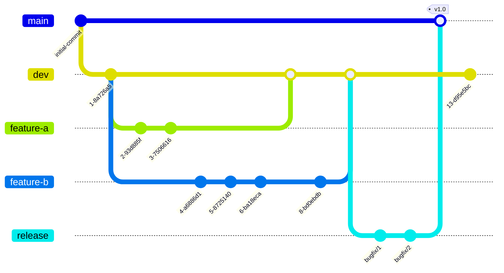

# Branching Strategies

A well-defined branching strategy helps teams work more effectively by:

1. Providing a framework for organizing code changes and collaboration
2. Managing the risks associated with code changes through separate branches for development and production
3. Enabling effective version control and rollback

:::tip How do I choose a strategy?
Consider project size, number of engineers, and testing requirements. High-visibility projects may need more testing overhead; small teams working on distinct features can move faster with simpler workflows.
:::

---

## GitHub Flow (Low Complexity)

One default branch (`main`). Feature branches are created off `main` and merged back when complete.

### Workflow

1. Create a `main` branch representing the latest stable version
2. Create a feature branch off `main` with a descriptive name (e.g., `eknorr/new-login-page`)
3. Make commits on the feature branch
4. Merge back into `main` via pull request when complete
5. Repeat for each feature

### Pros
- Fast and streamlined
- Quick feedback loop
- Well suited for small teams

### Cons
- More susceptible to bugs (no development buffer)
- Not well suited for multiple release versions

---

## GitFlow (Medium Complexity)

Two permanent branches: `main` and `dev`. Features branch off `dev` and merge back. Only `dev` merges into `main` at release time.

### Workflow

1. Create `main` (stable) and `dev` (development) branches
2. Checkout feature branches from `dev`
3. Merge features back into `dev`
4. When ready for release, merge `dev` into `main` (optionally via a `release` branch for final testing)
5. Tag the release

### Pros
- Parallel development with production isolation
- Easier to manage multiple versions
- Well-organized branch types

### Cons
- Higher complexity
- More branches to manage

---

**Next**: [Create a Branch](./create-a-branch)
